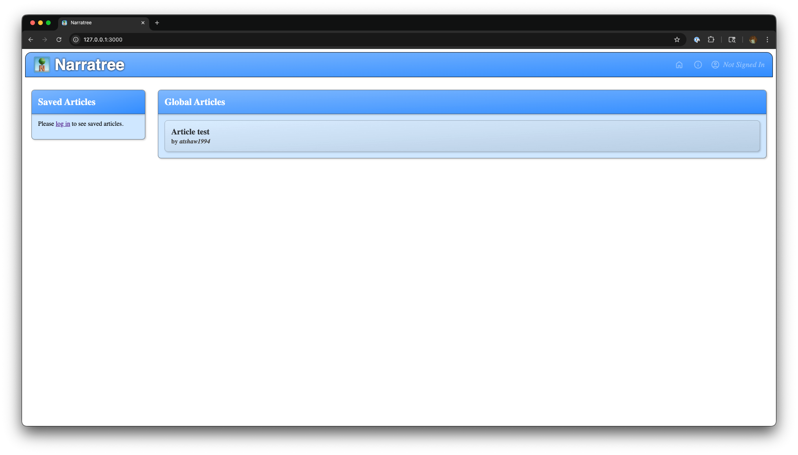
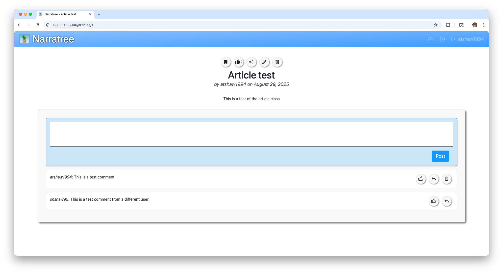

# Narratree





## Description

Narratree is a simple blogging platform built with Ruby on Rails. Users can create articles and leave comments. This project is part of The Odin Project curriculum.

## Branches

- **main** : This branch contains the **stable, production-ready** version of the application. Commits to _main_ are typically made only after a feature has been thoroughly tested and is ready for release.

- **beta** : This is our **public testing** branch. It contains the latest features and fixes that are ready for user feedback before being merged into _main_. We encourage users to check out this branch to test upcoming changes and report any issues.

## Roadmap

View the current roadmap at [Trello](https://trello.com/b/YSJnFamJ/narratree)

## Features

- Create, edit, and delete articles
- Upload and display article photos
- Add and delete comments on articles
- Responsive and modern UI
- Validations to prevent blank submissions
- Like articles and comments
- Save articles to your saved articles list
- Light/Dark Mode
- Share articles
- Email Notifications

## Getting Started

### Prerequisites

- Ruby 3.x
- Rails 7.x
- SQLite3 (default) or another supported database
- libvips (recommended for image uploads and processing with Active Storage)

### Setup

1. Clone the repository:
   ```sh
   git clone https://github.com/atshaw1994/Narratree.git
   cd Narratree
   ```
2. Install dependencies:
   ```sh
   bundle install
   ```
3. Install libvips (recommended for image uploads):
   ```sh
   # macOS (Homebrew)
   brew install vips
   # Ubuntu/Debian
   sudo apt-get install libvips
   ```
4. Set up the database:
   ```sh
   bin/rails db:setup
   ```
5. Start the server:
   ```sh
   bin/rails server
   ```
6. Visit `http://localhost:3000` in your browser.

## Usage

- Create a new article from the homepage.
- Add comments to articles.
- Delete comments and articles as needed.

## Contributing

Pull requests are welcome! For major changes, please open an issue first to discuss what you would like to change.

## License

This project is licensed under the MIT License.
